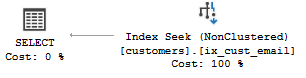
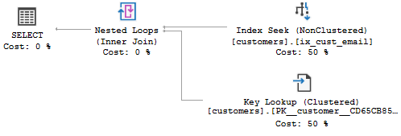
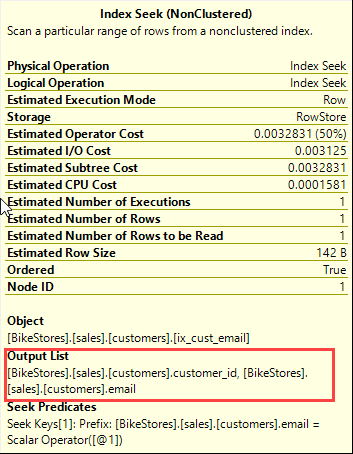
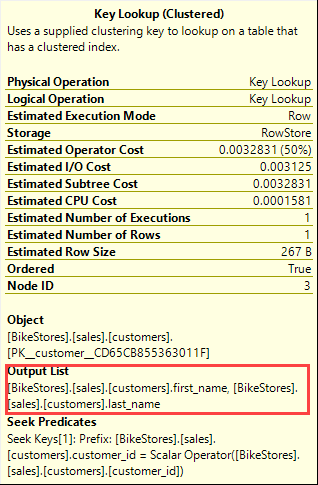
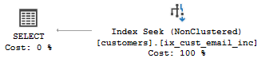

# 索引中的 Include

## 前情概要

这几天被一个数据库语句难道了，语句是这样的

```mssql
SELECT ta.ID,ta.FA,tb.FB,tc.FC FROM ta
INNER JOIN tb ON tb.ID = ta.tbID
INNER JOIN tc ON tb.ID = tc.tcID
WHERE tb.ID IN (...)
```

这是一个很简单的内联查询，当然本身这几个表里面的数据是很庞大的，不过条件筛选中的 `tb.ID IN (...)` 中的数据也是只有 20 个，所以理论上查出来是非常快的。但是查询出来缺需要 1 分钟左右的时间，这明显是有问题的。

我的第一反应是 — — 索引。

然后我查看了相关表的索引结构，发现该有的字段索引都有（有关系表的外键非聚集索引，还有其他相关的表的复合索引）

后面让我更奇怪的是，当我删掉 `SELECT` 中的某个字段重新查询时，却发现不到一秒就全部查出来了。看到这种情况我是懵逼的，我根本不知道这是怎么回事，我都不好描述这种 SQL 情景。

后来我找来公司的 DBA 过来帮忙看这个问题，他看了之后就默默的说了一句：“原来的索引建的不合适，得在索引后面加上 INCLUDE(tb.FB)”。然后重新执行发现不到一秒就查出来了。

说真的，有那么一瞬间我觉得我智商受到了打击。

后来查 INCLUDE 关键字发现能出来不少相关的资料，也就有下面这篇译文 — — 从 SQL 执行计划分析索引的 INCLUDE 的作用。

## 译文

原文地址：http://www.sqlservertutorial.net/sql-server-indexes/sql-server-indexes-with-included-columns/

事先准备数据表结构：

```mssql
CREATE TABLE dbo.DEMO_customers (
 customer_id INT IDENTITY (1, 1) PRIMARY KEY,
 first_name VARCHAR (255) NOT NULL,
 last_name VARCHAR (255) NOT NULL,
 phone VARCHAR (25),
 email VARCHAR (255) NOT NULL,
 street VARCHAR (255),
 city VARCHAR (50),
 state VARCHAR (25),
 zip_code VARCHAR (5)
);
```

然后我们来给 `email` 列新建一个唯一索引

```mssql
CREATE UNIQUE INDEX ix_cust_email
ON dbo.DEMO_customers(email);
```

这面这段语句是查找 email 是 `'aide.franco@msn.com'` 的用户

```mssql
SELECT
	customer_id
	email
FROM
	DEMO_customers
WHERE
	email = 'aide.franco@msn.com';
```

我们查看上面这段 SQL 的执行计划，你就会发现查询优化器使用了在非聚集索引上进行索引扫描操作。



现在我们来看看下面例子

```mssql
SELECT
	first_name,
	last_name,
	email
FROM
	DEMO_customers
WHERE email = 'aide.franco@msn.com';
```

下面是执行计划



在这个执行计划中：

首先，查询优化器在非聚集索引 `ix_cust_email` 上用了索引扫描来查找 `email` 和 `customer_id`。



第二，查询优化器在非聚集索引 `DEMO_customers` 表上使用键查找通过 `customer_id` 来查询表 customer 的 `first_name` 和 `last_name`。



第三，对于在非聚集索引的查找的每行，它在聚集索引中使用嵌套循环来行匹配。

你可以看到查询语句的键查询的开销是 50%，这是非常昂贵的。

为了减少键查询的开销，SQL Server 允许你通过**包含非键列**（including non-key columns）拓展非聚集索引的功能。

通过在非聚集索引中包含非键列，你可以创建非聚集索引并覆盖更多的查询

> 注意，这个索引包含所有的查询字段引用时，通常将这个索引被称为覆盖查询。

首先，从表 `DEMO_customer` 销毁索引 `ix_cust_email`

```mssql
DROP INDEX ix_cust_email
ON DEMO_customers;
```

然后，创建新的索引 `ix_cust_email_inc`，它包含了两个字段 `first_name` 和 `last_name`

```mssql
CREATE UNIQUE INDEX ix_cust_email_inc
ON DEMO_customers(email)
INCLUDE(first_name,last_name);
```

现在我们再来看下查询优化器，它仅仅使用了非聚集索引扫描来返回查询的数据



一个包含列的索引能很好的提高查询性能，因为所有的列在查询中都包含在索引中了；查询优化器能通过索引就能定位到所有列值，而不需要访问表或聚集索引，从而较少磁盘 I/O 操作。

## 创建包含列的索引的语法

下面来分析创建一个包含列非聚集索引的语法

```mssql
CREATE TABLE INDEX index_name
ON table_name(key_column_list)
INCLUDE(include_column_list);
```

在这个语法中：

- 第一，在 `CREATE INDEX` 从句后面指定索引的名称。如果索引是唯一的，你需要增加 `UNIQUE` 关键字。
- 第二，在 ON 从句后面指定索引的表名和列的键名集合。
- 第三，在从句 `INCLUDE` 中以逗号分隔符的包含列集合

## 拓展资料

https://www.cnblogs.com/gaizai/archive/2010/01/11/1644358.html